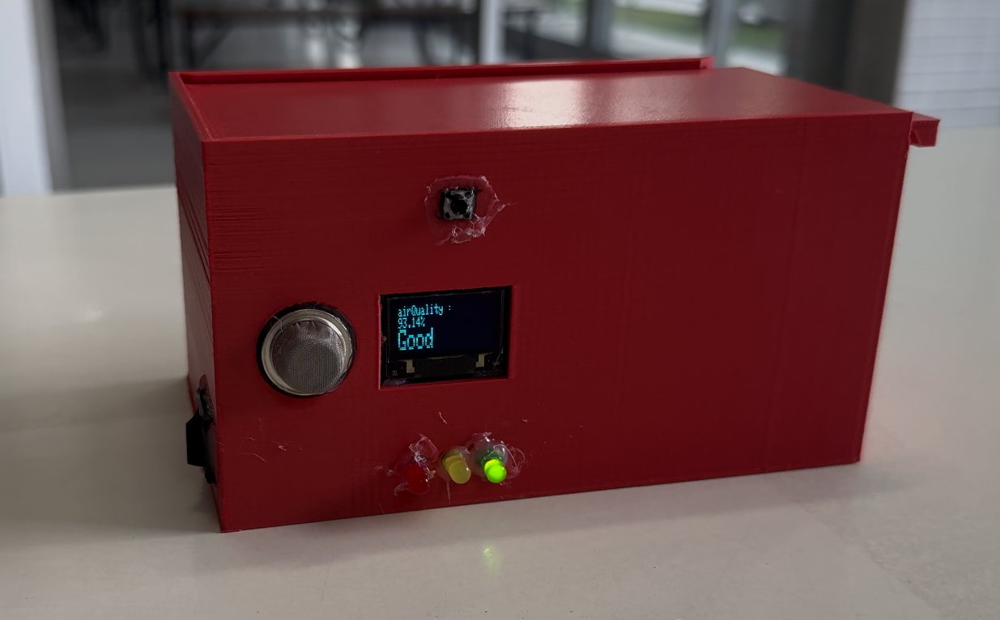

# โครงงานตรวจวัดคุณภาพอากาศแบบเรียลไทม์

โครงงานนี้พัฒนาอุปกรณ์ตรวจวัดคุณภาพอากาศแบบเรียลไทม์โดยใช้ไมโครคอนโทรลเลอร์ Arduino R4 UNO WIFI เป็นตัวควบคุมหลัก อุปกรณ์ประกอบด้วยเซนเซอร์ MQ-135 Unified Sensor สำหรับตรวจจับก๊าซอันตราย เช่น ก๊าซคาร์บอนมอนอกไซด์ และก๊าซแอลกอฮอล์ ข้อมูลที่ได้จากเซนเซอร์จะถูกนำมาประมวลผลโดย Arduino R4 UNO WIFI และแสดงผลผ่านไฟ LED เพื่อบ่งบอกระดับความเป็นอันตรายของก๊าซ และจอ OLED เพื่อแสดงค่าที่วัดได้อย่างละเอียด และสามารถส่งข้อมูลค่าการวัดขึ้นเว็บไซต์หรือ Application ได้ในระดับเรียลไทม์ เพื่อให้ผู้ใช้งานสามารถตรวจสอบข้อมูลได้จากทุกที่ทุกเวลา

## คุณสมบัติ

* ตรวจจับก๊าซอันตราย เช่น คาร์บอนมอนอกไซด์ และแอลกอฮอล์
* แสดงผลผ่านจอ OLED และไฟ LED
* ส่งข้อมูลแบบเรียลไทม์ผ่าน Blynk Cloud ไปยังแอปพลิเคชันมือถือและเว็บไซต์
* ใช้งานง่ายและติดตั้งสะดวก

## ฮาร์ดแวร์

* Arduino R4 UNO WIFI
* MQ-135 เซนเซอร์แก๊ส
* จอ OLED
* ไฟ LED

## ไลบรารี

* **WiFiS3:** เชื่อมต่ออุปกรณ์เข้ากับเครือข่าย Wi-Fi
* **BlynkSimpleWifi:** เชื่อมต่อกับแพลตฟอร์ม Blynk
* **MQUnifiedsensor:** อ่านค่าจากเซนเซอร์แก๊ส MQ135
* **SPI:** การส่งข้อมูลระหว่างอุปกรณ์อิเล็กทรอนิกส์
* **Wire:** การสื่อสารแบบ I2C
* **Adafruit_GFX:** ไลบรารีพื้นฐานสำหรับจอ OLED
* **Adafruit_SSD1306:** ไลบรารีสำหรับจอ SSD1306

## การทำงาน

**Input:** รับข้อมูลก๊าซด้วย MQ-135 ซึ่งทำงานโดยอาศัยหลักการเปลี่ยนแปลงค่าความต้านทานในอากาศเมื่อสัมผัสกับก๊าซต่างๆ

**Output:** แสดงข้อมูลที่เซนเซอร์วัดได้ ผ่านทางจอ OLED, LED, แอปพลิเคชันมือถือ และเว็บไซต์ โดยมี Blynk Cloud เป็นตัวกลางในการเชื่อมต่อและส่งข้อมูลแบบเรียลไทม์

## รูปภาพ

## วิดีโอสาธิต

## ผู้พัฒนา
นายพงศ์พิสุทธิ์     ทัพวงษ์          66070124

นายพิสิษฐ์		    งามเลิศพัฒนสิริ	  66070136

นายเพชรแพรทอง  	อินอุทัย		      66070139

นายภัทรพล		    เยาวราช		      66070148
